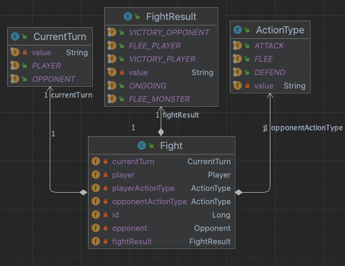

# Dungeon Chaos Backend

**Developer**: Jeff Ou  
**Description**: A backend-only application that is used for a single-player board-like game with turn-based fighting that is set within a grid of blocks, players strategically navigate through the dungeon, uncovering hidden pathways, encountering dangerous monsters, and collecting valuable loot.  
**Frontend Repo**: https://github.com/pophero110/Dungeon-Chaos-Frontend

# Technologies

**Trello**: resource management  
**IntelliJ**: development IDEA  
**Draw.io**: Create Entity Relationship Diagram  
**Postman**: APIs Testing and Documentation  
**Sourcetree**: Git GUI  
**Cucumber**: Behavior-driven testing framework  
**JUnit**

# ERD

# User story by Domain

# API Reference

# Credit

- Thanks to my instructor, [Suresh Sigera](https://github.com/sureshmelvinsigera/), who gave me strong encouragement and trust for building this project
- Thanks to my roommates from Room 9 in Zoom for being with me and kind feedback on my project
